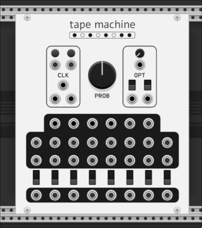

# turing's bits

just a plugin for making random interesting stuff i don't want to put in alef's bits for whatever reason.

## modules

### tape machine

a Turing Machine clone with some extra bits.

- clock input shifts the bits of a 16 bit number circularly, and randomly sets bits on and off according to the probability parameter.
- set and clear params/inputs toggle bits on and off while button is held or gate is high.
- shift amount param/input is the number of bits to shift (1-15).
- direction param/switch changes the direction of the shift to left-to-right (default) or right-to-left.
- individual bit ports output a pulse for that bit if it is set (pulse mode set beteween trigger/clock/hold in context menu).
- random pulse output outputs a pulse signal when a bit is toggled (pulse mode set between trigger/clock/hold in context menu).
- voltage outputs the value of the 16 bit number.
- flipped outputs the value of the 16 bit number with the bits flipped.
- min and max outputs the min and max of the voltage and flipped voltage on a given clock cycle.

you can now also switch to "dual" mode with the corresponding switch and input. when in dual mode, the full 16-bit tape is split in two and treated as two individual 8-bit tapes, each with their own RNG for toggling bits according to the probability knob. both individual tapes can also be reset to 0 with the two "Reset" inputs below the "Clock" input. when not in dual mode, only the leftmost "Reset" input (labeled 'Main/A' in tooltip) is used to reset the whole tape.
