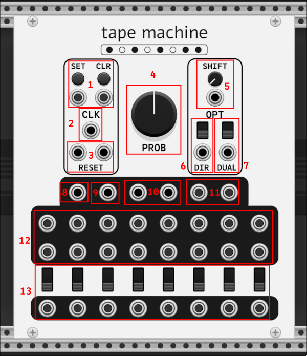

# turing's bits

just a plugin for making random interesting stuff i don't want to put in [alef's bits](https://github.com/alefnull/alefsbits) for whatever reason.

## modules

### tape machine

a Turing Machine clone with some extra bits.

1) set and clear params/inputs toggle bits on and off on each clock pulse while button is held or input gate is high.

2) clock input shifts the bits of a 16 bit number circularly, and randomly sets bits on and off according to the probability parameter.

3) reset ("Main/A" and "B") tape(s) to zero. in normal (non-dual) mode, only the leftmost ("Main/A") input will reset the full tape ("B" will do nothing). in dual mode, the two inputs will reset only their respective half of the full tape.

4) probability param/input determines the probability that a bit will be toggled on a given clock pulse.

5) shift amount param/input is the number of bits to shift (1-15).

6) direction switch/input changes the direction of the shift to left-to-right (default) or right-to-left.

7) dual mode switch/input toggles between "normal" (default) and "dual" mode. in "dual" mode, the full 16 bit tape is split in two and treated as two individual 8 bit tapes, each with their own RNG for toggling bits according to the probability.

8) voltage outputs the value of the 16 bit number.

9) flipped outputs the value of the 16 bit number with the bits flipped.

10) min and max outputs the min and max of the voltage and flipped voltage on a given clock cycle.

11) random pulse output outputs a pulse signal when a bit is toggled (pulse mode set between trigger/clock/hold in context menu).

12) individual bit ports output a pulse for that bit if it is set (pulse mode set between trigger/clock/hold in context menu).

13) 8 logic switches and outputs to get the logical result between the two bits above them in the same 'column'. toggle switches between AND, OR, and XOR, and get pulse outputs when the operation is true (pulse mode set between trigger/clock/hold in context menu).
