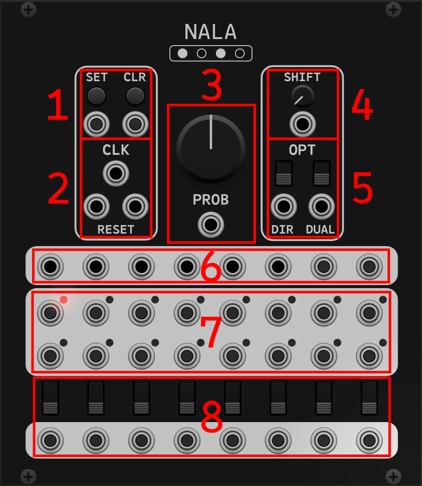
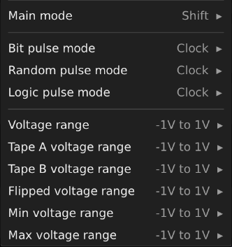

Turing's Bits
=============

just a plugin for making random interesting stuff i don't want to put in [alef's bits](https://github.com/alefnull/alefsbits) for whatever reason.

Nala
----

a Turing Machine clone with some extra bits.

> ---
>
> Panel
> -----
>
> 
>
> 1) 'Set' and 'Clear' params/inputs toggle bits on and off on each clock pulse while button is held or input gate is high.
>
> 2) 'Clock' input shifts the bits of a 16 bit number circularly, and randomly sets bits on and off according to the probability parameter. 'Reset' inputs reset ("Main/A" and "B") tape(s) to zero. in normal (non-dual) mode, only the leftmost ("Main/A") input will reset the full tape ("B" will do nothing). in dual mode, the two inputs will reset only their respective half of the full tape.
>
> 3) 'Probability' param/input determines the probability that a bit will be toggled on a given clock pulse.
>
> 4) 'Shift' param/input is the number of bits to shift (1-15).
>
> 5) 'Direction' switch/input changes the direction of the shift to left-to-right (default) or right-to-left. 'Dual' switch/input toggles between "normal" (default) and "dual" mode. in "dual" mode, the full 16 bit tape is split in two and treated as two individual 8 bit tapes, each with their own RNG for toggling bits according to the probability.
>
> 6) 'Voltage' outputs the value of the full 16 bit number. 'Tape A' and 'Tape B' output their respective halves of the full 16 bit number as two 8 bit numbers. 'Flipped' outputs the full 16 bit number with all bits flipped. 'Minimum' and 'Maximum' output their respective values derived from a comparison of the full Voltage value and its Flipped counterpart. lastly, the 'Random Pulse' ports output a pulse when a bit in the corresponding tape(s) is flipped. (voltage ranges and pulse modes set in context menu)
>
> 7) individual 'Bit' ports output a pulse for that bit if it is set (pulse mode set in context menu).
>
> 8) 'Logic' switches and outputs get the logical result between the two bits above them in the same 'column'. switch between AND, OR, and XOR, and get pulse outputs when the operation is true (pulse mode set in context menu).
>
> ---
>
> Context Menu
> ------------
>
> 
>
> there are 3 "Main" modes to choose from:
>
> 1) 'Shift' (default) - shifts all bits in the value(s) on each clock pulse, and decides whether or not to flip the most/least-significant bit (depending on 'Direction') according to the 'Probability' param/input.
>
> 2) 'Walk' - shifts all bits in the value(s) on each clock pulse, and a 'walker' (or walkers, in dual mode) randomly traverses up and down its respective tape and decides whether or not to flip the bit it ended up on according to the 'Probability' param/input.
>
> 3) 'Random' - shifts all bits in the value(s) on each clock pulse, and randomly chooses a bit to target (one for each row in dual mode), and decides whether or not to flip the bit it targets according to the 'Probability' param/input.
>
> there are 3 "Pulse" modes:
>
> 1) 'Clock' (default) - allows the 'Clock' input signal to pass through this output.
>
> 2) 'Trigger' - outputs a single trigger pulse from this output.
>
> 3) 'Hold' - toggles between on/off with each pulse from this output.
>
> ---
